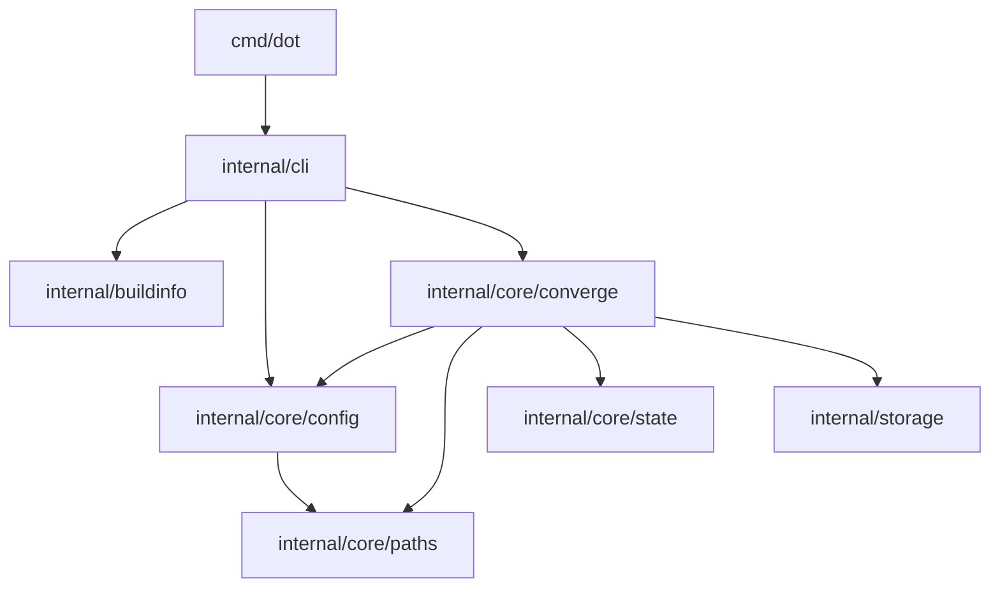

# 架构概览

本文只描述当前 Go package 的稳定职责和依赖形状，不定义产品行为，也不维护当前每一条
import 的镜像。产品数据流、结果与安全边界以[产品规范索引](../spec/README.md)为准；当前契约取舍见
[ADR 0003](../decisions/0003-lexical-convergence-loop.md)。本页描述当前 Go package
职责；测试证据归属见[测试架构](testing.md)。内部类型、函数和系统调用以当前代码为证据。

## Package 职责

| Package | 唯一职责 |
| --- | --- |
| `internal/buildinfo` | 构建版本数据 |
| `internal/storage` | 私有控制目录与控制文件原子发布原语 |
| `internal/core/paths` | 词法 HOME target 与控制路径前缀 |
| `internal/core/state` | Link ownership state 模型、校验与编解码 |
| `internal/core/config` | Repository、machine、module 配置加载和 platform matching |
| `internal/core/converge` | Selection、同一条循环、lock、mutation 与 commit |
| `internal/cli` | 命令语法、环境构造、公开输出与退出码 |
| `cmd/dot` | 最小进程入口 |

## 当前依赖形状

当前 production imports 从进程入口流向 CLI，再流向拥有相应决定的 core package；底层
path/state/storage 当前不反向依赖 converge 或 CLI。依赖形状可概括为：

该图只帮助阅读当前 package 分层，不是需要与 imports 同步维护的 allowlist。实际依赖以 production
imports 和 `go.mod` 为准；新增 package、反向依赖或第三方能力时，直接在变更 diff 中解释职责与
必要性，不再维护第二份 package/依赖 owner 注册表。

## 修改架构时

先回答三个问题：

1. 需要集中表达的唯一不变量是什么，当前为何无法由既有 owner 表达？
2. 哪个 package 应拥有决定，哪些调用方只消费结果？
3. 哪些 owner package 或跨层行为测试能证明变化没有建立第二真相源？

普通内部类型或算法调整由最简单的当前实现决定，不需要 ADR。只有难以逆转、跨多个区域且未来
仍需理解理由的选择才进入 [ADR](../decisions/README.md)。
