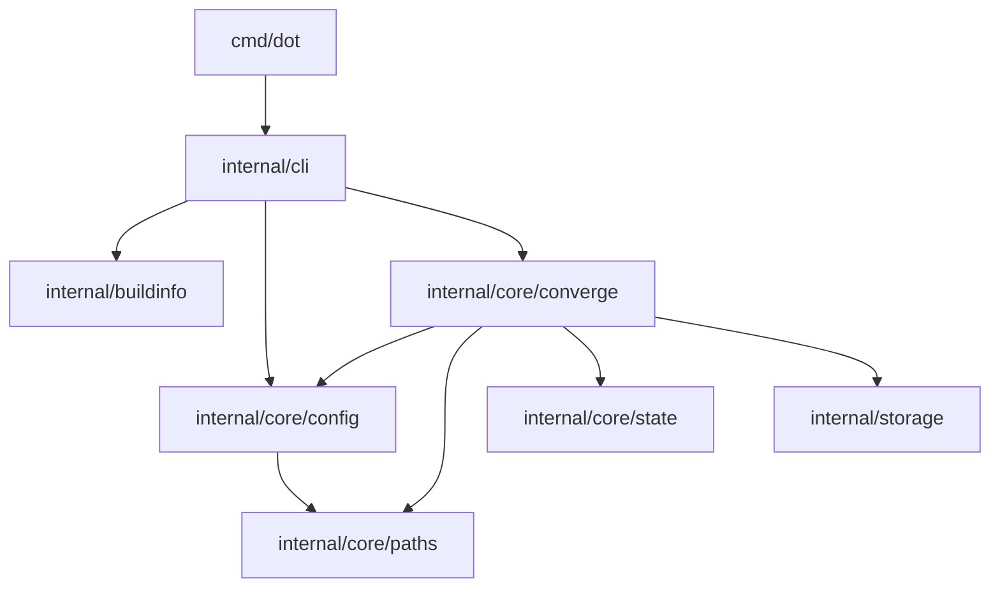

# 架构概览

本文只描述当前 Go package 的稳定职责和允许依赖方向，不定义产品行为，也不维护当前每一条
import 的镜像。产品数据流、结果与安全边界以[产品规范索引](../spec/README.md)为准；Convergence
V4 的关键取舍理由见 [ADR 0002](../decisions/0002-convergence-v4.md)；测试证据归属见
[测试架构](testing.md)。内部类型、函数和系统调用以当前代码为证据。

## Package 职责

| Package | 唯一职责 |
| --- | --- |
| `internal/buildinfo` | 构建版本数据 |
| `internal/storage` | 私有控制目录与控制文件原子发布原语 |
| `internal/core/paths` | HOME target/source 解析、typed control topology 与路径事实分类 |
| `internal/core/state` | Link ownership state 模型、校验与编解码 |
| `internal/core/config` | Repository、machine、module 配置加载和 platform matching |
| `internal/core/converge` | Selection、analysis、reconcile、lock、mutation、复核与 commit |
| `internal/cli` | 命令语法、环境构造、公开输出与退出码 |
| `cmd/dot` | 最小进程入口 |

## 允许依赖方向

依赖只能从进程入口流向 CLI，再流向拥有相应决定的 core package；底层 path/state/storage 不得反向
依赖 converge 或 CLI。允许方向可概括为：

这些箭头是允许边界，不是要求当前必须存在的 import inventory。删除已经不需要的依赖无需同步添加
占位引用；新增 production package、越过允许方向或反向依赖仍必须先解释职责变化并更新机械政策。

第三方能力也按职责归属：advisory lock 只能由 converge 使用，私有文件原子发布只能由 storage
使用，配置解码只能由 config 使用，CLI framework 只能由 CLI 使用。具体允许的 module path 与 owner
由 `internal/architecture/dependencies_test.go` 机械约束；未登记的直接第三方依赖或错误 owner 都会
失败。标准库、测试依赖、tool-only module 和 transitive dependency 不进入该政策。

## 修改架构时

先回答三个问题：

1. 需要集中表达的唯一不变量是什么，当前为何无法由既有 owner 表达？
2. 哪个 package 应拥有决定，哪些调用方只消费结果？
3. 哪个架构测试、跨层行为测试和规范 owner 能证明变化没有建立第二真相源？

普通内部类型或算法调整由最简单的当前实现决定，不需要 ADR。只有难以逆转、跨多个区域且未来
仍需理解理由的选择才进入 [ADR](../decisions/README.md)。
