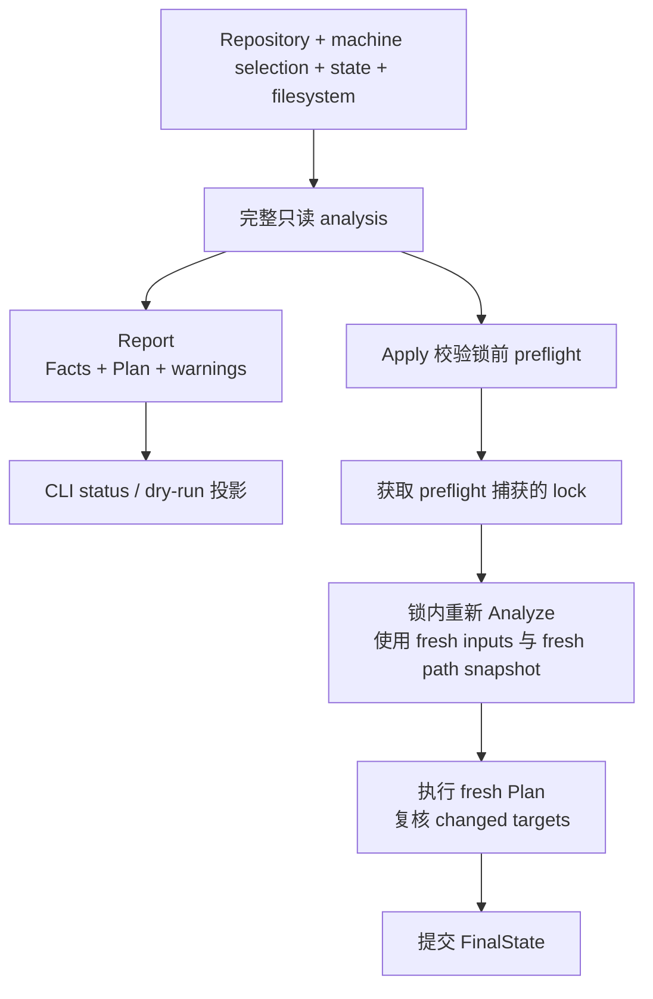

# 架构概览

本文描述当前 Go 实现的稳定职责、数据流和依赖边，不定义产品行为。产品结果以
[产品规范索引](../spec/README.md)为准；关键 convergence 取舍的理由见
[ADR 0001](../decisions/0001-convergence-v3.md)。内部类型、函数和系统调用以当前代码为证据，
不在本页维护镜像。

## 系统数据流

`status` 与 dry-run 调用 `converge.Analyze`，只投影完整只读 analysis。`apply` 在锁前使用同一个
analysis 实现做零写入 preflight，取得该次快照中的 lock 后，在锁内重新读取输入和路径身份；
锁前 Plan 不进入执行。

`init`、`select add` 与 `select remove` 走较窄的 selection mutation 路径：操作级 preflight →
lock → reload → 原子发布 machine config。它们不读取 state，也不规划或修改 target。

## 核心职责与不变量

1. **CLI 只负责边界投影。** `internal/cli` 解析参数、构造环境、调用 core，并把 Report 或 typed
   error 转成 stdout/stderr 与退出码；不拥有 selection 解析、planning、lock、target mutation
   或 state commit。
2. **Converge 是编排与 mutation 的唯一 owner。** 完整 analysis、selection resolution、Plan、
   lock、target mutation、结果复核和 config/state commit 都在 `internal/core/converge` 收口。
3. **一次 analysis 只使用一个 control topology 快照。** `internal/core/paths` 把 HOME、config、
   state、lock 与 repository 的词法/解析身份固定为不可变 `ResolvedControls`；planner 不接收并行
   raw-control 路径，也不自行重新解析 topology。
4. **一个 placement key 只有一个最终决定。** Planner 为每个 `(module, placement)` 生成一个
   Transition，并一次性计算 FinalState；executor 执行有序 Actions，不在执行途中增量修补 state。
5. **锁内事实优先。** Apply 只执行锁内重新 analysis 得到的 Plan；锁前 selection fingerprint 只
   用于检测 machine selection 漂移，不让旧 filesystem、state 或 resolved identity 泄漏到执行。
6. **私有控制文件发布集中。** `internal/storage` 提供 config/state 的私有原子发布边界；业务层不
   各自实现覆盖、权限和临时文件协议。

这些是内部 ownership 约束。公开的全量加载、path、planning、锁和恢复行为仍分别由
[CLI](../spec/cli.md)、[placements](../spec/placements.md)、[planning](../spec/planning.md)与
[mutation](../spec/mutation-and-recovery.md)规范拥有。

## Package 地图

| Package | 唯一职责 |
| --- | --- |
| `internal/buildinfo` | 构建版本数据 |
| `internal/storage` | 私有控制目录与控制文件原子发布原语 |
| `internal/core/paths` | HOME target/source 解析、control topology 与路径事实分类 |
| `internal/core/state` | Ownership state 模型、校验与编解码 |
| `internal/core/config` | Repository、machine、module 配置加载和 platform matching |
| `internal/core/converge` | Selection、analysis、planning、lock、mutation、复核与 commit |
| `internal/cli` | 命令语法、环境构造、公开输出与退出码 |
| `cmd/dot` | 最小进程入口 |

生产 package 的直接内部依赖由 `internal/architecture/dependencies_test.go` 双向固定：

| Source | 允许直接 import |
| --- | --- |
| `internal/buildinfo`、`internal/storage`、`internal/core/paths`、`internal/core/state` | 无内部依赖 |
| `internal/core/config` | `internal/core/paths` |
| `internal/core/converge` | `internal/core/config`、`internal/core/paths`、`internal/core/state`、`internal/storage` |
| `internal/cli` | `internal/buildinfo`、`internal/core/config`、`internal/core/converge` |
| `cmd/dot` | `internal/cli` |

未列出的边、缺失的既有边和未知 production package 都会使架构测试失败。需要改变依赖时，先
说明职责为何移动，再同步本页、代码和机械约束；不能只放宽 allowlist。

## 第三方依赖 owner

架构测试同样双向固定生产代码的直接第三方 import：

| 第三方 package | 唯一 owner |
| --- | --- |
| `github.com/google/renameio/v2` | `internal/storage` |
| `github.com/gofrs/flock` | `internal/core/converge` |
| `github.com/pelletier/go-toml/v2` | `internal/core/config` |
| `github.com/spf13/cobra` | `internal/cli` |

标准库、repository 内部 import、测试依赖、tool-only module 和 transitive dependency 不进入该表。
工具版本与调用入口由 `tools/go.mod` 和 [Makefile](../../Makefile)拥有。

## 修改架构时

先回答三个问题：

1. 需要集中表达的唯一不变量是什么，当前为何无法由既有 owner 表达？
2. 哪个 package 应拥有决定，哪些调用方只消费结果？
3. 哪个架构测试、跨层行为测试和规范 owner 能证明变化没有建立第二真相源？

普通内部类型或算法调整由最简单的当前实现决定，不需要 ADR。只有难以逆转、跨多个区域且未来
仍需理解理由的选择才进入 [ADR](../decisions/README.md)。
