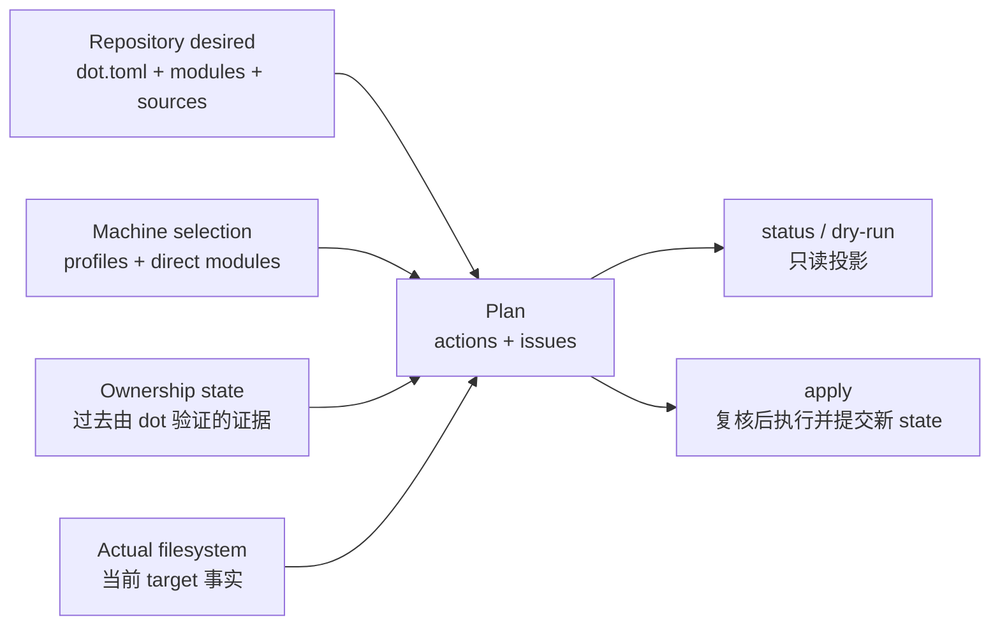

# `dot` 的工作模型

理解 `dot` 最有效的方法不是先背命令，而是把它看成一个收敛器：它比较“这台机器应该是什么
样子”和“现在实际是什么样子”，产生计划，并在得到明确 mutation 命令时执行计划。

本页是解释层。精确产品行为由[产品规范](../spec/README.md)拥有。

## 四类输入，一个计划



- **Repository desired** 描述可选择的 modules、placements 和 source，是用户维护的期望来源。
- **Machine selection** 描述当前机器启用了哪些 profiles 和直接 modules，不等于已经完成部署。
- **Ownership state** 保存 `dot` 曾验证过的 ownership 证据，帮助它判断哪些历史 link 可以安全
  清理；它不是期望配置的第二份副本。
- **Actual filesystem** 是计划时观察到的真实 target。已有普通文件、目录和未知 symlink 不会
  因为 manifest 想要同一路径就自动变成 `dot` 所有。
- **Plan** 把上述输入收敛为有序 actions 和结构化 issues。`status` / dry-run 展示它，`apply` 在安全复核
  后执行它。

规范中的完整输入和规划规则分别见
[selection](../spec/selection.md)、[modules and platforms](../spec/modules-and-platforms.md)、
[placements](../spec/placements.md)、
[state and ownership](../spec/state-and-ownership.md) 与 [planning](../spec/planning.md)。

## Selection 与 convergence 是两步

`init`、`select add` 和 `select remove` 改变的是 machine selection；它们不会顺手修改 target。
`apply` 读取当前完整 selection，统一规划所有 effective modules，并处理已经不再 active 的历史
ownership。

把两步分开有两个直接结果：

1. 你可以先明确“想启用什么”，再通过 `status` 或 dry-run 审查文件系统变化；
2. `apply` 不需要猜测某次命令只想处理哪个 module，它始终让整台机器回到一个一致状态。

例如教程中的流程是：

```text
empty selection
  -> select add starship
  -> starship is desired but target is pending
  -> apply
  -> selection, state and filesystem agree
```

命令级契约见 [CLI 规范](../spec/cli.md)。

## State 是证据，不是授权捷径

Desired 只能说明“现在希望这里有什么”，不能证明“现在这里的东西是谁创建的”。State 保存
过去成功收敛后验证过的事实，让 `dot` 能区分自己拥有且未漂移的 link，与不应触碰的用户数据。

因此：

- 删除 manifest 条目不会自动赋予删除任意 target 的权限；
- state 丢失后仍可创建当前 desired，但可能失去发现历史 link 的能力；
- target 漂移会使旧 ownership 证据不足，系统应报告 blocker issue 或忘记证据，而不是强制覆盖。

需要从用户角度理解这些边界，继续阅读
[所有权与安全边界](ownership-and-safety.md)；持久格式和精确判定只在
[state 规范](../spec/state-and-ownership.md)中定义。

## 收敛不变量

一次成功 apply 后，在 repository、machine selection、state 和实际文件系统都不变化的条件下，
再次 apply 必须是 no-op。这一性质让“重跑完整命令”成为部分失败后的主要恢复方法，而不需要
隐藏 rollback 或逐 module 补偿流程。

Apply 仍可能在操作系统错误或外部并发修改下部分完成。锁、执行顺序、提交边界和中断恢复由
[mutation and recovery 规范](../spec/mutation-and-recovery.md)定义。

## 不在这个模型里的事情

`dot` 管理配置文件的选择与放置，不负责安装软件、运行 hooks、渲染模板、管理秘密、同步 Git
或提供 backup/rollback。完整范围和明确接受的风险见[产品定义](../spec/product.md)。

遇到问题时，先按四类输入定位：

1. Repository desired 是否写对？
2. 当前 machine selection 是否真的包含该 module？
3. State 是否存在、有效并与当前 HOME 对应？
4. Actual filesystem 是否有冲突或漂移？

这比从某一条错误文本反推内部函数更接近系统真正的判断方式。
