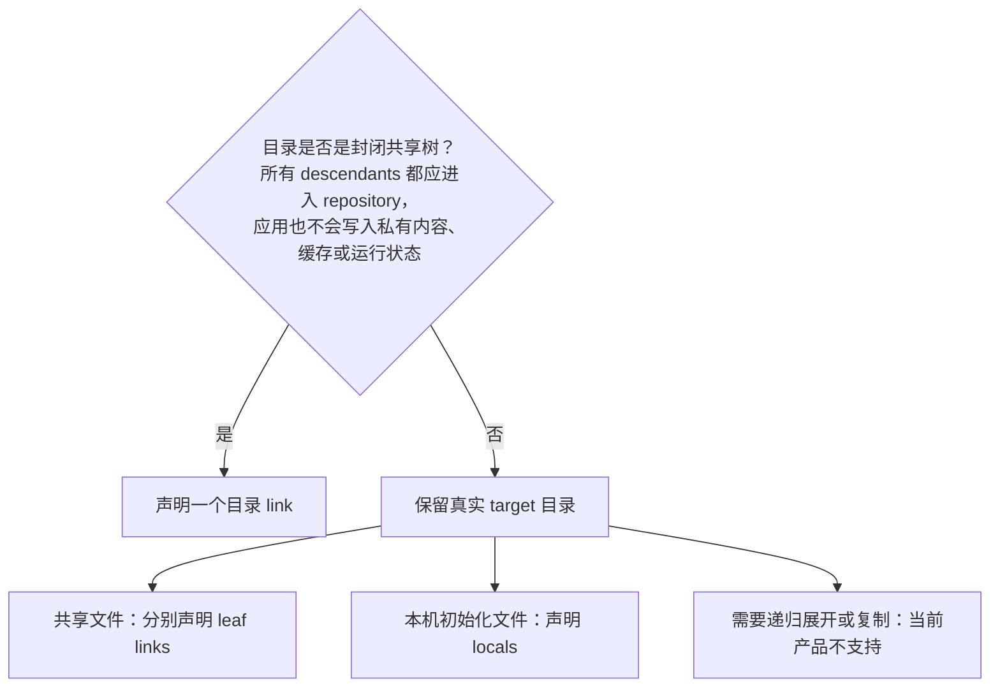

# 管理 modules 与 placements

本指南面向两类任务：在某台机器上启用/停用已有 module，以及在 repository 中新增或调整
module。开始前先理解 [selection 与 convergence 分离](../concepts/mental-model.md#selection-与-convergence-是两步)：
选择变化不会立即修改 target，只有全量 `dot apply` 才收敛文件系统。

字段、路径与冲突的精确定义分别由
[selection 规范](../spec/selection.md)、[modules 规范](../spec/modules-and-platforms.md)、
[placements 规范](../spec/placements.md)和
[planning 规范](../spec/planning.md)拥有。

## 在一台机器上启用已有 module

先查看 module 声明和 source，不要从 module 名字猜测它会改哪些路径：

```sh
MODULE_ID=starship
sed -n '1,240p' "modules/$MODULE_ID/module.toml"
dot paths
dot status
```

直接选择一个 module：

```sh
dot select add "$MODULE_ID"
dot apply --dry-run
dot apply
dot status
```

`select add` 只写 machine config 中的直接 selection。Dry-run 中出现的每个 target 都应由你确认；
已有普通文件、目录或未知 symlink 会产生 blocker issue，不会被自动导入或覆盖。

当前仓库中的 `starship` 是最小实例：

```sh
dot select add starship
dot apply --dry-run
```

第一次使用项目时，先完成[隔离入门教程](../getting-started.md)，不要直接在真实 HOME 练习。

## 停用一个直接选择的 module

```sh
MODULE_ID=starship
dot select remove "$MODULE_ID"
dot apply --dry-run
dot apply
dot status
```

`select remove` 只移除 `extra_modules` 来源。如果 active profile 仍选择该 module，它仍然
effective；命令会明确提示这一点。退出 desired 后，历史 link 是否 prune、ownership 是否
forget，以及 local 为什么保留，由[planning 规范](../spec/planning.md)决定。

不要在 `select remove` 后手工删除 state，也不要只清理一个看起来相关的 target：下一次全量
apply 会把当前 selection 与全部 stale records 放在同一个计划中处理。

## 新增一个 module

最小 portable module 结构如下：

```text
modules/example/
├── module.toml
├── config
└── config.local.example
```

一个同时包含共享 link 与本机 local 的 manifest 可以写成：

```toml
[match]
os = ["macos", "linux"]

[[links]]
id = "config"
source = "config"
target = "~/.config/example/config"

[[locals]]
id = "local"
example = "config.local.example"
target = "~/.config/example/config.local"
```

编写时逐项确认：

1. Module 与 placement ID 稳定、合法且不重复；
2. Source/example 位于 selected module root 内，并已加入 repository；
3. Target 使用 `~/`，位于 HOME 内且不与其他 effective placement 或 control path 重叠；
4. 共享内容使用 link，本机后续自行维护且只需首次初始化的文件使用 local；
5. 平台差异确实需要 variants 时再引入，不为未来可能性复制 manifest。

完整 schema 和校验条件见
[modules and platforms](../spec/modules-and-platforms.md)与
[placements](../spec/placements.md)。代码、测试与 CI 才能证明
当前实现接受该 manifest，文档示例不能替代 dry-run。

## 文件 link、目录 link 还是 leaf placements

文件 link 最直接。目录 source 则把整个 target 部署成一条 symlink：source 内新增、删除或修改
会立即出现在 target，通过 target 写入的内容也直接进入 repository source。



目录 link 适合完全由 repository 承载的封闭树。共享配置与本机内容混在同一目录时，保留真实
目录并分别声明 leaf placements，避免应用生成数据通过 symlink 写回 repository。

把已经部署的目录 link 改成 descendants 不是一次 manifest 编辑；必须按
[安全迁移 placements](safe-migrations.md#把目录-link-拆成-leaf-placements)完成两阶段迁移。

## Profile 还是直接 selection

- 多台机器反复复用的一组 modules：在 `dot.toml` 中定义 profile；
- 某台机器独有或临时启用的 module：使用 `dot select add/remove`；
- 不要为了少写一条命令，把机器特例永久塞进共享 profile；
- 不要把 profile 当作继承、覆盖或条件系统，它只是一组 module ID。

配置 active profiles 和平台 variants 的完整操作见
[管理 profiles 与平台差异](profiles-and-platforms.md)。

## 从 repository 移除 module

多机器环境采用收缩优先的顺序：

1. 从所有 repository profiles 中移除该 module；
2. 在仍直接选择它的机器上运行 `dot select remove MODULE_ID`；
3. 每台有历史记录的机器分别 dry-run 并全量 apply，确认 prune/forget/local 保留结果；
4. 确认不再有 active profile 引用后，再删除 module 目录；
5. 再次在受影响机器运行 status，确认 repository、selection、state 与文件系统一致。

Active profile 引用已经不存在的 module 会使配置无效，因此不能先删目录再指望 apply 自动猜测
profile 意图。删除 repository 文件和在每台 HOME 中完成 cleanup 是两个不同完成边界。

## 完成检查

- `dot status` 中 selection 来源符合预期；
- dry-run 不包含未审查 target，也没有 blocker issue；
- apply 成功后再次 dry-run 已收敛；
- local 内容没有被误当作共享 source；
- repository 变更与 machine-local selection 变更各自由正确 owner 表达。

遇到异常时不要添加 force 或直接编辑 state，按[故障排查](troubleshooting.md)从输入事实定位。
