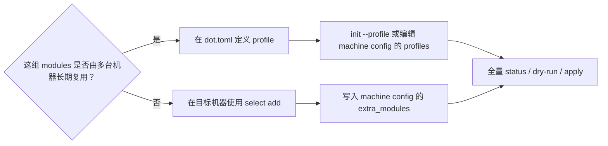

# 管理 profiles 与平台差异

Profiles 解决“哪些机器复用同一组 modules”，platform matching 解决“同一 module 在当前平台
是否适用、选择哪个 variant”。两者职责不同：profile 不包含条件逻辑，variant 也不改变机器
selection。

Profile 与 machine selection 规则见[selection 规范](../spec/selection.md)，module 与 platform
解析见[modules and platforms 规范](../spec/modules-and-platforms.md)。本指南提供建模与操作路径。

## 选择 profile 还是直接 module



Profile 是 repository 维护的命名集合：

```toml
version = 1

[profiles]
base = ["git", "zsh", "starship"]
work = ["work-git"]
```

多 profile 只取 module 集合并集，顺序不表达覆盖。机器特例使用 `extra_modules`，不要复制一个
只差单个 module 的 profile；只有它已经成为稳定、可复用的机器角色时才新增 profile。

## 初始化时选择 profiles

`--profile` 可以重复：

```sh
dot init /absolute/path/to/dotfiles --profile base --profile work
dot apply --dry-run
dot apply
```

`init` 只发布 machine config，不做首次收敛。省略 `--profile` 会选择 repository 中必须存在的
`default` profile；显式参数完全替代该默认值。多个 profile 使用集合语义，顺序不影响 selection，
重复参数会被拒绝。相同 repository 与 profile 集合重复 init 是 no-op，并保留已有直接 selection；
不同绑定不会被 init 自动重配。

## 修改已有机器的 active profiles

产品没有 profile 修改子命令。先定位当前 binary 使用的配置：

```sh
dot paths
```

打开输出中的 `machine_config`，只调整 `profiles` 数组，然后：

```sh
dot status
dot apply --dry-run
dot apply
dot status
```

不要同时手工改 `extra_modules` 来模拟 `select`，也不要修改 state。Machine config 是严格 TOML；
编辑错误或 profile 不存在会在 mutation 前失败。需要改 repository 绑定时同样先用 `dot paths`
定位，但当前产品不提供 rebind 命令；精确恢复边界见[产品定义](../spec/product.md)。

## Portable 还是 variants

同一份 placements 在所有适用平台都成立时，使用 portable module：

```toml
[match]
os = ["macos", "linux"]

[[links]]
id = "config"
source = "config"
target = "~/.config/example/config"
```

Target 或内容确实随平台变化时才使用 variants：

```toml
[variants.macos]
root = "."

[variants.macos.match]
os = ["macos"]

[[variants.macos.links]]
id = "config"
source = "config"
target = "~/Library/Application Support/example/config"

[variants.linux]
root = "."

[variants.linux.match]
os = ["linux"]

[[variants.linux.links]]
id = "config"
source = "config"
target = "~/.config/example/config"
```

`root = "."` 复用 module 根内容；内容不同再使用 `macos/`、`linux/` 等不同 roots。每个 variant
完整声明自己的 placements，不存在继承或 fallback。Portable 与 variants 不能在一个 module
混用。

## Applicability 的三种结果

| 结果 | 含义 | 应怎样处理 |
| --- | --- | --- |
| applicable | 所有受约束且所需的已知字段匹配 | 进入当前 desired 与 planning |
| not-applicable | 至少一个已知字段确定不匹配 | 检查这是预期平台排除，还是 match 写错 |
| indeterminate | 没有已知 mismatch，但至少一个必要字段无法确定 | 修复平台证据或收缩直接 selection，不要当作“不适用”跳过 |

字段之间是 AND、同一字段数组内是 OR。`distro` 只用于 `os = ["linux"]`。不要通过极宽的 match
或复制一个“默认 variant”掩盖 indeterminate；产品没有优先级、fallback 或 capability DSL。

`dot status` 会显示 selection 来源、applicability、variant 或诊断 reason：

```sh
dot status
```

Profile 选中但 not-applicable 是合法结果，并可触发旧 ownership cleanup；direct/extra selection
not-applicable 或 indeterminate 的 mutation 边界不同。不要从本表推导删除行为，精确规则见
[modules and platforms](../spec/modules-and-platforms.md)、[planning](../spec/planning.md)与
[mutation](../spec/mutation-and-recovery.md)。

## 多机器变更顺序

对 profile 内容、match 或 variants 的共享变更：

1. 列出会使用该 profile/module 的机器与平台；
2. 在 macOS/Linux 的合成测试中覆盖预期 applicability/variant；
3. 先在一台非关键机器上 status 与 dry-run；
4. 每台机器分别 apply 并再次 dry-run；
5. 只有所有受影响 HOME 完成旧 ownership cleanup 后，才移除旧 module/placement source。

`dot` 不提供远程编排，也不会自动 Git pull。Repository commit 已发布不等于每台机器已经完成
收敛；多机迁移检查清单见[安全迁移 placements](safe-migrations.md)。
