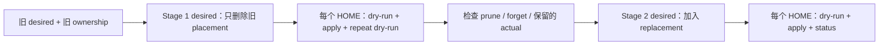

# 安全迁移 placements

Placement 迁移最危险的误区，是把“manifest 已经改成最终形态”当作“旧 ownership 已经安全
清理”。`dot` 的 state 属于每个 HOME，多机器必须分别完成中间状态。

本指南覆盖 link/local kind 转换和目录 link 拆分。强制边界由
[planning 规范](../spec/planning.md#placement-类型与层级迁移)拥有，执行和恢复由
[mutation 规范](../spec/mutation-and-recovery.md)拥有。

## 先判断是否需要两阶段

以下变化必须两阶段完成：

- 同一 placement 从 link 改为 local；
- 同一 placement 从 local 改为 link；
- 把一个 directory link 改成它的 target 下的 leaf links/locals。

同 kind link 的 target 变化可以由一个 Transition 规划为先建立新 target、再处理旧 target，但
仍需 dry-run 检查 ownership 和路径依赖。Placement ID 变化也不会自动绕过 actual target 冲突；
不要把“换 ID”当作类型转换机制。

## 迁移前清单

1. 列出所有仍选择该 module 或持有旧 state record 的机器/HOME；
2. 在每台机器运行 `dot paths`、`dot status` 和 `dot apply --dry-run`；
3. 确认 repository 工作树中 stage 1 与 stage 2 都能形成独立、可回退的 commit；
4. 记录旧 target 是 link、local、目录还是已经漂移，不要只看 manifest；
5. 暂停会同时写这些 target 的应用，减少计划后外部变化；
6. 不删除 state，不预先创建 replacement，不使用一次最终 desired 跳过中间状态。

## 通用两阶段流程



### Stage 1：只退出旧 desired

从 manifest 删除旧 placement，但不要同时加入 replacement 或 descendants。Directory-link 拆分
期间，其他 effective modules 也不能声明会通过旧 parent link 到达的 child target。

对每个 HOME：

```sh
dot status
dot apply --dry-run
dot apply
dot apply --dry-run
```

如果 apply 失败或提示可能部分完成，保持 Stage 1 repository desired 不变，先按输出处理问题并
重跑完整 `dot apply`。Actual target 已消失不能单独证明 state 已成功提交；重复 dry-run 收敛才是
进入检查步骤的必要证据。

### 检查中间状态

- 仍匹配完整 ownership 的 stale link 可能被 prune；
- 漂移 link 会 forget ownership 并保留 actual；
- local 永远保留 actual，只 forget provenance；
- 任何保留的路径都必须由用户决定迁移、改名或继续保留，`dot` 不会自动备份或导入。

每台机器的结果可以不同。只有所有受影响 HOME 都完成 Stage 1，并且 replacement target 不再被
旧实际对象阻塞，才能发布 Stage 2。

### Stage 2：加入 replacement

加入新的 link/local 或 leaf placements，然后在每个 HOME 中：

```sh
dot status
dot apply --dry-run
dot apply
dot status
dot apply --dry-run
```

新的 desired 仍遵循普通 target、ownership、control-path 和 antichain 规则。Stage 1 成功不会
给 Stage 2 的任意已有 target 自动授权。

## Link 转 local

Stage 1 删除 link placement。若旧 link 仍完整 owned，它会被 prune；若已漂移，它会保留，需要
用户先处理。Stage 2 才声明 local：

```toml
[[locals]]
id = "config-local"
example = "config.local.example"
target = "~/.config/example/config"
```

Local 只在 target absent 时从 example 创建。Stage 1 遗留的任何目录项都会被当作已存在而 keep，
不会被 example 覆盖。使用新 ID 可以让配置意图更清楚，但不能省略 Stage 1。

## Local 转 link

Stage 1 删除 local placement 只会 forget provenance，不会删除 local 文件。进入 Stage 2 前，用户
必须在仓库外决定如何保留内容，并让新 link target absent；否则 link 会因已有普通文件而
conflict。

不要把可能含秘密的 local 直接复制进 repository。先审查内容和 Git 历史影响，再独立处理 source。

## 把目录 link 拆成 leaf placements

假设旧配置把 `~/.config/example` 整体链接到 repository。Stage 1 只删除 parent directory link，
不能同时添加 `~/.config/example/config` 等 descendants。

所有 HOME 完成 Stage 1 后：

1. 确认旧 parent target 已 absent，或由用户明确建立为真实目录；
2. 检查目录中是否有不应进入 repository 的私有内容、缓存或运行状态；
3. Stage 2 分别添加共享 leaf links 与缺失时初始化的 locals；
4. Dry-run 确认 leaf targets 互不重叠，也不穿过仍 owned 的旧 parent link；
5. Apply 后验证应用写入私有内容时不会回流到 repository。

目录部署方式的选择见[管理 modules](manage-modules.md#文件-link目录-link-还是-leaf-placements)。

## 多机器完成标准

Repository 合入 Stage 2 不是迁移完成。完成需要每个受影响 HOME 都有证据：

- 使用的是预期 repository revision；
- Stage 1 曾成功收敛，而非直接从旧 desired 跳到最终 desired；
- Stage 2 apply 成功，重复 dry-run no-op；
- 保留的 local/漂移数据已经由对应机器 owner 处理；
- 旧 source、manifest 和临时迁移说明可以安全移除。

如果无法保证某台机器经历 Stage 1，暂缓 Stage 2 或为该机器恢复 Stage 1 revision。当前产品没有
跨版本 migration engine、远程协调或 reset 命令替代这一过程。
