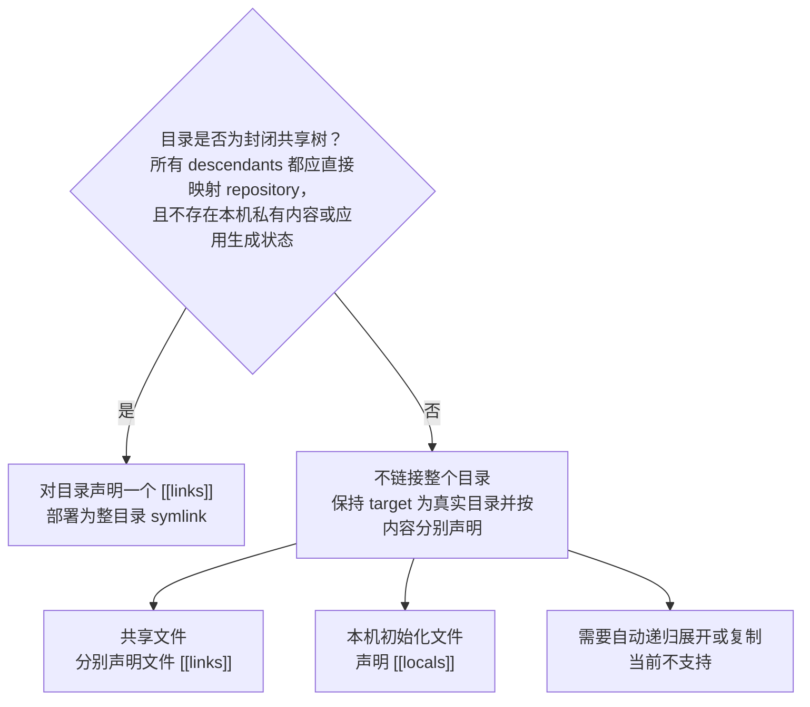

# Placements 与路径边界

Placement ID 在所属 module 的 `links` 和 `locals` 中共同唯一。Source/example 必须显式声明；
`module.toml` 不会被隐式链接。

## Link

```toml
[[links]]
id = "config"
source = "config"
target = "~/.config/example/config"
```

- Source 相对于 portable root 或 selected variant root。
- Source 必须存在，其顶层对象只能是普通文件或目录，不得是 symlink 或 special；否则为配置
  错误、零 mutation。该约束针对 desired source，与 dangling actual 链的规划规则正交。
- Selected root 的解析身份必须位于 module root 内；source/example 经过现存 ancestor symlink
  解析后的身份必须位于 selected root 内，否则为配置错误、零 mutation。
- Source 目录内部不递归检查，内部 symlink 由用户负责。
- Link desired identity 由 source 路径决定，不比较 source 内容；仅发生同一路径下内容变化时
  不要求重建 symlink 或更新 state。
- 文件与目录都作为一个完整 symlink placement，不递归生成单文件 links。
- Target 必须以 `~/` 开头，不支持绝对路径、环境变量、glob 或命令替换。
- Target 规范化后必须位于逻辑 HOME 下。
- `dot` 创建指向绝对 source 的 symlink。

### 目录 source 的语义与选型

目录 source 表示一个完整 symlink placement。`dot` 只规划、记录和验证 target 这一条目录
symlink，不递归解释或记录其 descendants；source 内新增、删除或修改内容会直接反映到 target，
不需要再次 apply。通过 target 写入的内容也会进入 repository 中的 source 目录。

因此，目录 link 应仅用于封闭共享树：目录内所有内容都应由 repository 直接承载，并且应用不会
在其中写入不应进入 repository 的本机私有内容、缓存或运行状态。需要共享配置与本机内容共存时，
不要把该目录本身声明为 directory link；保持对应 target 目录为真实目录，分别声明其下具体文件的
links 和需要在缺失时初始化的 locals。自动递归展开目录、tree folding 和共享文件复制不属于当前
产品。把已有 directory link 改为这些 leaf placements 时，必须使用
[`planning.md` 的两阶段迁移](planning.md#两阶段-placement-迁移)，不能在一次 desired 变更中
同时删除 parent link 并加入 descendants。

#### 目录部署决策树



## Local

```toml
[[locals]]
id = "local"
example = "config.local.example"
target = "~/.config/example/config.local"
```

- Example 必须存在且为普通文件，只做字节复制；缺失或类型不符为配置错误、零 mutation。
- Local 的 create、keep、退出 desired 和 provenance 行为由
  [`planning.md`](planning.md#local) 定义。
- `*.local.example -> *.local` 是推荐命名，不是语法要求。

## 路径身份与边界

- HOME、repository、target 以及进入 machine config 或 state 的解析后路径都必须是有效 UTF-8；
  不支持只能用原始字节表示的文件系统路径，并在 mutation preflight 拒绝。
- Target 先展开 HOME 并做词法规范化。
- 对现存 ancestor symlink，解析到其实际父路径；missing suffix 按原名称追加。
- CLI 按命令 scope 提供 participating placements；该集合中的任意两个 active desired
  placements 必须构成 target antichain：规范化 target 或解析后 target 相等、互为祖先或
  后代时拒绝。参与集合由 [`cli.md`](cli.md#命令-scope-与加载) 定义。State-only stale
  records 不进入该集合，其清理关系由 [`planning.md`](planning.md#通用决策规则) 定义。
- 该不变量不区分 link/local、source 是文件还是目录，也不依赖 actual target 当前类型。
- Parent symlink 合法；路径关系同时比较 lexical 和 resolved identity。Link state 保存的
  resolved target 及其变化对应的 step eligibility 分别由
  [`state-and-ownership.md`](state-and-ownership.md#ownership-规则) 和
  [`planning.md`](planning.md#link) 定义。
- State-owned parent link 与本轮 active link ownership 的实际 traversal 约束由
  [`planning.md`](planning.md#通用决策规则) 定义；只比较真实经过的 link 目录项，不因独立
  alias 最终到达同一 destination 而建立关系。

不额外探测 case sensitivity、Unicode alias、filesystem type 或 hard-link identity。

### Control-path topology

- Config root 是 machine config 的直接父目录；machine config 必须是该 root 的直接子项。
- State root 是 state 与 lock 的共同直接父目录；state 与 lock 必须是两个不同的 sibling。
- Config root 与 state root 的最终对象必须是直接的真实目录，不得是 symlink；更高层
  ancestor symlink 合法。
- Control family 分为：
  - repository tree；
  - config root tree，以及 machine config 目录项与最终解析身份；
  - state root tree，以及 state/lock 目录项与最终解析身份。
- 三个 family 在词法规范化、现存 ancestor 解析和最终 control 解析后的任意交叉表示中，不得
  相等或互为祖先、后代。
- 参与当前命令 path validation 的 active placement target 不得与任一 control family 相等、
  包含它或位于其中。
- 这些关系由同一套只读路径身份比较实现。
- Control 文件的公开发现入口及输出契约只由 [`cli.md`](cli.md#paths) 定义。

Control topology 自身无效或 active target 越界时，规划不可执行。已退出 desired 的 stale
target 与 control family 重叠时采用不同的保守清理规则，见
[`planning.md`](planning.md#通用决策规则)。
